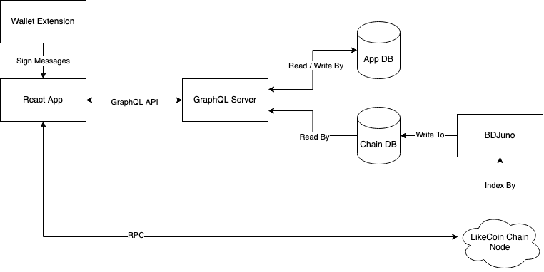

# LikeDAO

LikeDAO is a web app to facilitate participation and discussion in LikeCoin Chain's governance.

Built using React, GraphQL, Golang and PostgreSQL. Deployed with Kubernetes and Helm.

## Architecture



See [Architecture Docs](./docs/Architecture.md) for more details.

## Development

### Quick Start

```
make setup
docker-compose up

# In another tab

make -C react-app dev
```

Then visit http://localhost:3000

### Prerequisite

- asdf <https://asdf-vm.com/#/core-manage-asdf?id=install>
- Docker Compose <https://docs.docker.com/compose/install/>

### Requirements

- Golang 1.18
- Node 16
- Yarn 1.22.17

Managed by [asdf](https://github.com/asdf-vm/asdf)

### React App

Please visit [here](./react-app/README.md#development) for more information

### GraphQL Server

Please visit [here](./graphql-server/README.md#development) for more information

### BDJuno

Please visit [here](./bdjuno/README.md#development) for more information

## Deployment

Please visit [here](./deploy/README.md) for more information

## Contributing

See [Contributing Docs](./docs/Contributing.md)
